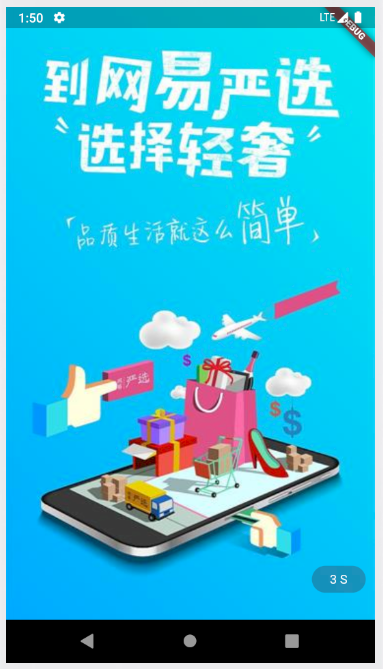
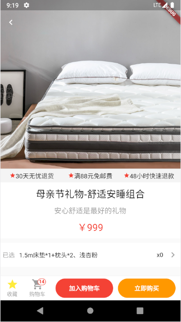
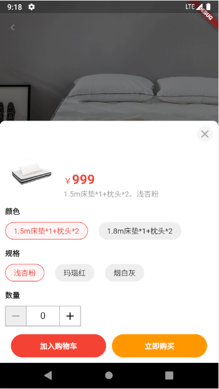
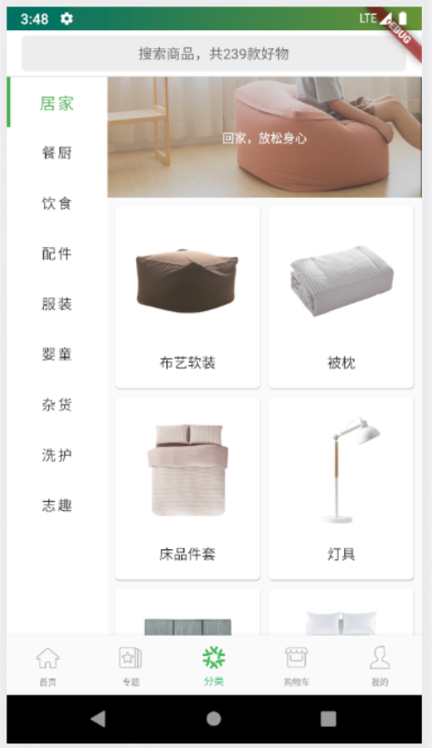
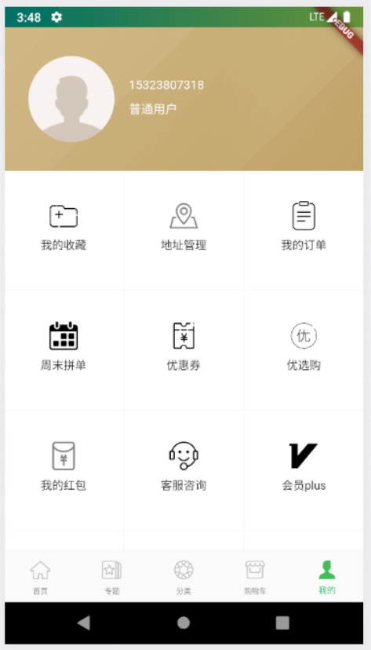
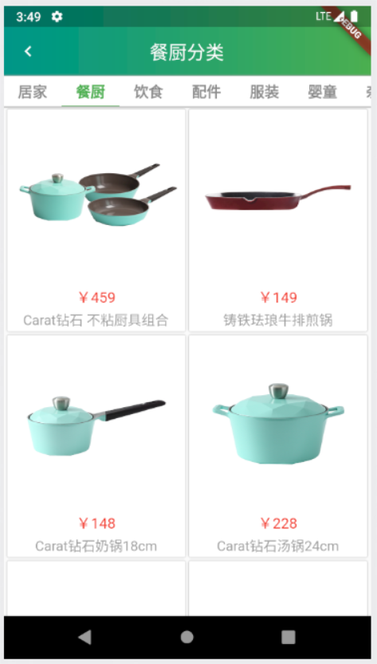
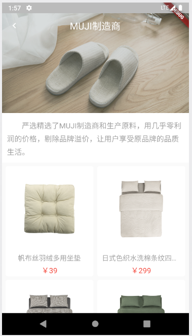
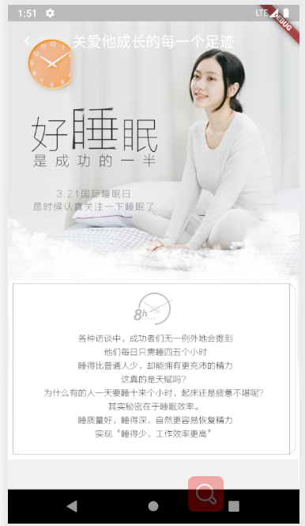
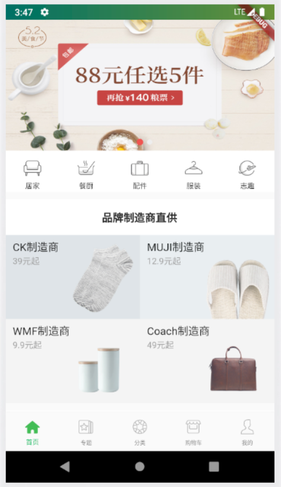
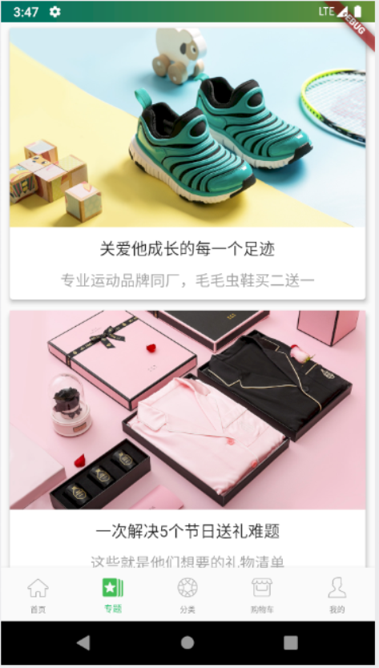

# EasyMarketFlutter

> 1、EasyMarketFlutter是仿网易严选 设计的 App（商城类）。项目是基于 Flutter框架的混合开发（Android与IOS）
>
> 2、EasyMarketFlutter主要技术栈:provider(全局数据管理)、dio(数据请求)、shared_preferences（缓存）。
>
> 3、本项目主要是以学习Flutter框架为主，主要可学内容：UI设计、组件封装、解决Flutter中遇到的坑。可能项目中有许多缺陷，希望吐槽，来不断完善。

## 扫码体验Android版(请在浏览器内扫码！)

<figure >

</figure >

## 预览

|           |  |  |   |
| ---------------------------- | ---------------------------- | -------------------------- | ---------------------- |
|         |        |    |  |
|  |         |      |                        |

## 已实现

* Provider+shared_preferences实现数据状态管理、缓存。
* App的启动页、广告页。
* Rem适配方案。
* Dio的二次封装，API模块化。
* 封装侧边栏Tab切换组件。
* 封装Appbar与Tab的AppbarTab组件。
* 封装滚动渐变的Appbar组件。
* 下拉刷新与上拉加载更多。
* 路由模块管理。

## 还需要做的事

1. 此项目还在开发中，后续会把业务补充完整。（商品、专题、制造商、购物车、用户信息管理）页面的完善。
2. 项目优化，从UI到性能分析，我也是Flutter的初学者，后续如果有学到好的方案，需迭代。
3. 尝试将部分模块以WebView+H5进行混合开发。
4. 后续会补充我在开发中遇到的问题，进行补充、和记录。

## 需注意的东西

* 目前只提供了android的下载体验，IOS请自行下载代码体验。
* 在开发环境的debug可能会稍微卡顿，属正常现象，良好的体验请进行打release包。

## 友情链接

1. [Flutter中文网](https://flutterchina.club/) 
2. [Dart从入门到放弃](http://dart.goodev.org/)
3. [Flutter从入门到放弃](https://book.flutterchina.club/)
4. [Flutter-go](https://github.com/alibaba/flutter-go)
5. [Flutter路由管理](https://github.com/theyakka/fluro) 
6. [Flutter很全的Api说明](https://github.com/yang7229693/flutter-study)
7. [我写的项目](https://github.com/Peroluo/easyMarketFlutter)
8. [常用的一些包](https://www.cnblogs.com/yangyxd/p/9232308.html)
9. [阿里巴巴Flutter代码规范](https://github.com/alibaba/flutter-go/blob/master/Flutter_Go%20%E4%BB%A3%E7%A0%81%E5%BC%80%E5%8F%91%E8%A7%84%E8%8C%83.md)

## 最后

* 如果EasyMarketFlutter对你有帮助，留下你的Star或者fork，你的支持是我不断更新的动力！！
* 欢迎你们的Issues,希望Flutter越来越好，大家一起学习!Love Coding!
* Thanks!

## 关于我

Name: pero 罗

QQ: 1025558554

Email：[1025558554@qq.com](mailto:1025558554@qq.com)